# Building a Wayland Compositor from First Principles

## Table of Contents
1. [System Overview](#system-overview)
2. [Hardware Layer](#hardware-layer)
3. [Kernel Layer: DRM/KMS](#kernel-layer-drmkms)
4. [Userspace Layer](#userspace-layer)
5. [Raspberry Pi OS Architecture](#raspberry-pi-os-architecture)
6. [Building Your Own Compositor](#building-your-own-compositor)
7. [Implementation Roadmap](#implementation-roadmap)

---

## System Overview

The Linux graphics stack is a complex layered architecture that allows applications to render graphics and display them on screen. Understanding it from first principles means understanding each layer and how they interact.

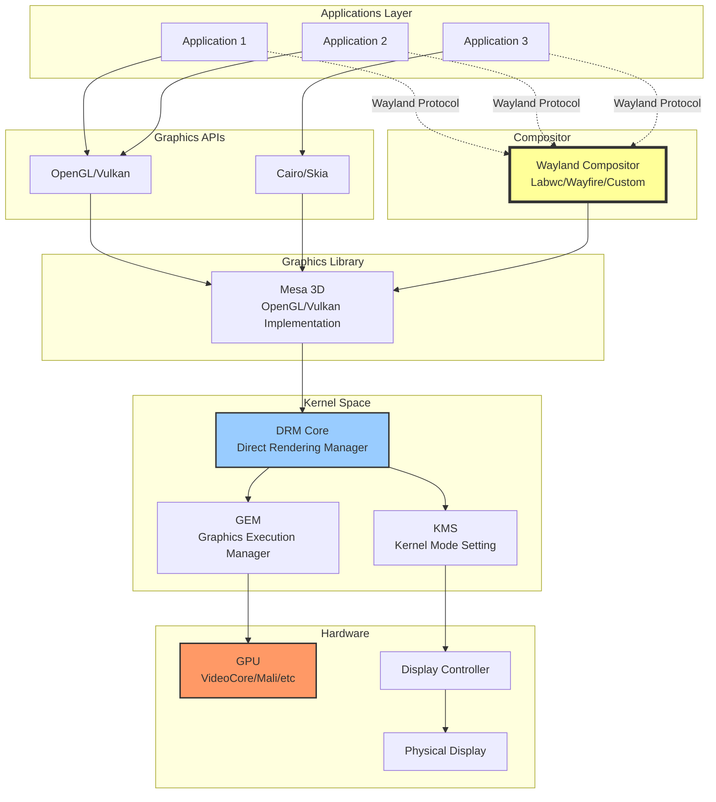
```mermaid
graph TB
    subgraph "Applications Layer"
        APP1[Application 1]
        APP2[Application 2]
        APP3[Application 3]
    end

    subgraph "Graphics APIs"
        GL[OpenGL/Vulkan]
        CAIRO[Cairo/Skia]
    end

    subgraph "Compositor"
        WC[Wayland Compositor<br/>Labwc/Wayfire/Custom]
    end

    subgraph "Graphics Library"
        MESA[Mesa 3D<br/>OpenGL/Vulkan Implementation]
    end

    subgraph "Kernel Space"
        DRM[DRM Core<br/>Direct Rendering Manager]
        KMS[KMS<br/>Kernel Mode Setting]
        GEM[GEM<br/>Graphics Execution Manager]
    end

    subgraph "Hardware"
        GPU[GPU<br/>VideoCore/Mali/etc]
        DISPLAY[Display Controller]
        MONITOR[Physical Display]
    end

    APP1 --> GL
    APP2 --> GL
    APP3 --> CAIRO
    GL --> MESA
    CAIRO --> MESA

    APP1 -.Wayland Protocol.-> WC
    APP2 -.Wayland Protocol.-> WC
    APP3 -.Wayland Protocol.-> WC

    WC --> MESA
    MESA --> DRM
    DRM --> KMS
    DRM --> GEM
    KMS --> DISPLAY
    GEM --> GPU
    DISPLAY --> MONITOR

    style WC fill:#ff9,stroke:#333,stroke-width:4px
    style DRM fill:#9cf,stroke:#333,stroke-width:2px
    style GPU fill:#f96,stroke:#333,stroke-width:2px
```

---

## Hardware Layer

### What Hardware Components Are Involved?

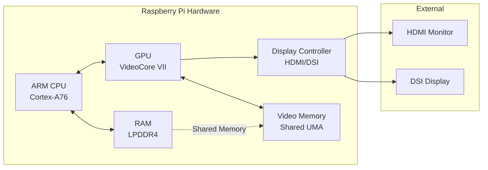
```mermaid
graph LR
    subgraph "Raspberry Pi Hardware"
        CPU[ARM CPU<br/>Cortex-A76]
        MEM[RAM<br/>LPDDR4]
        GPU[GPU<br/>VideoCore VII]
        DC[Display Controller<br/>HDMI/DSI]
        VRAM[Video Memory<br/>Shared UMA]
    end

    subgraph "External"
        HDMI[HDMI Monitor]
        DSI[DSI Display]
    end

    CPU <--> MEM
    CPU <--> GPU
    GPU <--> VRAM
    GPU --> DC
    DC --> HDMI
    DC --> DSI

    MEM -.Shared Memory.-> VRAM
```

### Key Hardware Concepts

1. **Unified Memory Architecture (UMA)**: On Raspberry Pi, the GPU and CPU share the same physical memory. This is different from discrete GPUs that have dedicated VRAM.

2. **Display Controller**: Hardware responsible for:
   - Reading framebuffers from memory
   - Converting pixel data to display signals
   - Handling multiple displays
   - Managing refresh rates and timing

3. **GPU**: Handles:
   - 3D rendering
   - 2D acceleration
   - Video decode/encode
   - Compute operations (GPGPU)

---

## Kernel Layer: DRM/KMS

The Direct Rendering Manager (DRM) is the kernel subsystem that manages GPU access.

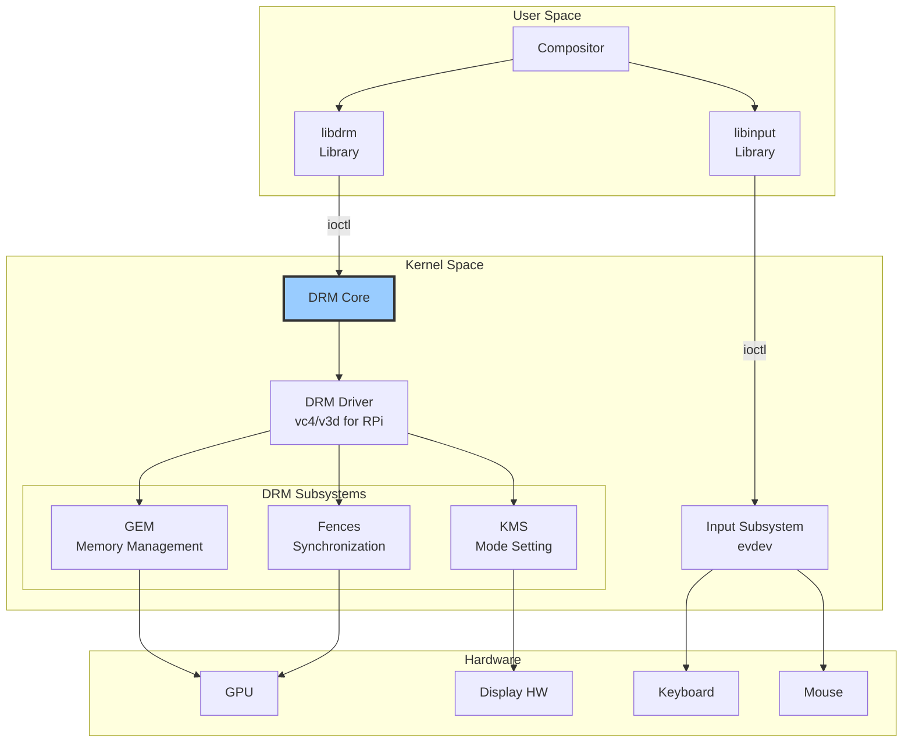
```mermaid
graph TB
    subgraph "User Space"
        COMP[Compositor]
        LIBDRM[libdrm<br/>Library]
        LIBINPUT[libinput<br/>Library]
    end

    subgraph "Kernel Space"
        DRMCORE[DRM Core]
        DRMDRIVER[DRM Driver<br/>vc4/v3d for RPi]

        subgraph "DRM Subsystems"
            KMS[KMS<br/>Mode Setting]
            GEM[GEM<br/>Memory Management]
            FENCE[Fences<br/>Synchronization]
        end

        INPUTSYS[Input Subsystem<br/>evdev]
    end

    subgraph "Hardware"
        GPU[GPU]
        DISPLAY[Display HW]
        KEYBOARD[Keyboard]
        MOUSE[Mouse]
    end

    COMP --> LIBDRM
    COMP --> LIBINPUT

    LIBDRM -->|ioctl| DRMCORE
    LIBINPUT -->|ioctl| INPUTSYS

    DRMCORE --> DRMDRIVER
    DRMDRIVER --> KMS
    DRMDRIVER --> GEM
    DRMDRIVER --> FENCE

    KMS --> DISPLAY
    GEM --> GPU
    FENCE --> GPU

    INPUTSYS --> KEYBOARD
    INPUTSYS --> MOUSE

    style DRMCORE fill:#9cf,stroke:#333,stroke-width:3px
```

### DRM Core Components

#### 1. **Kernel Mode Setting (KMS)**

KMS is responsible for configuring display outputs. Before KMS, mode setting was done in userspace, which was insecure and problematic.

**Key KMS Concepts:**

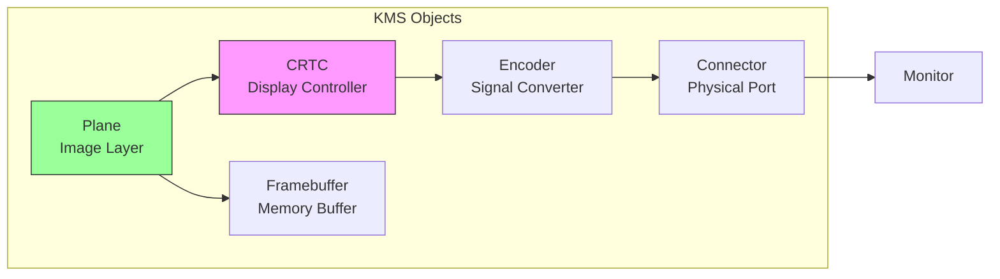
```mermaid
graph LR
    subgraph "KMS Objects"
        CRTC[CRTC<br/>Display Controller]
        ENCODER[Encoder<br/>Signal Converter]
        CONNECTOR[Connector<br/>Physical Port]
        PLANE[Plane<br/>Image Layer]
        FB[Framebuffer<br/>Memory Buffer]
    end

    PLANE --> FB
    PLANE --> CRTC
    CRTC --> ENCODER
    ENCODER --> CONNECTOR
    CONNECTOR --> MONITOR[Monitor]

    style CRTC fill:#f9f,stroke:#333
    style PLANE fill:#9f9,stroke:#333
```

- **CRTC (CRT Controller)**: Represents a display pipeline. Reads pixels from memory and generates video signals.
- **Encoder**: Converts pixel data to specific signal formats (HDMI, DisplayPort, DSI).
- **Connector**: Physical output port (HDMI connector, DSI connector).
- **Plane**: A layer that can be composited. Hardware may support multiple planes.
- **Framebuffer**: A region of memory containing pixel data.

**KMS Atomic API:**
Modern KMS uses atomic mode setting, where multiple changes are applied atomically (all or nothing).

#### 2. **Graphics Execution Manager (GEM)**

GEM manages GPU memory buffers.

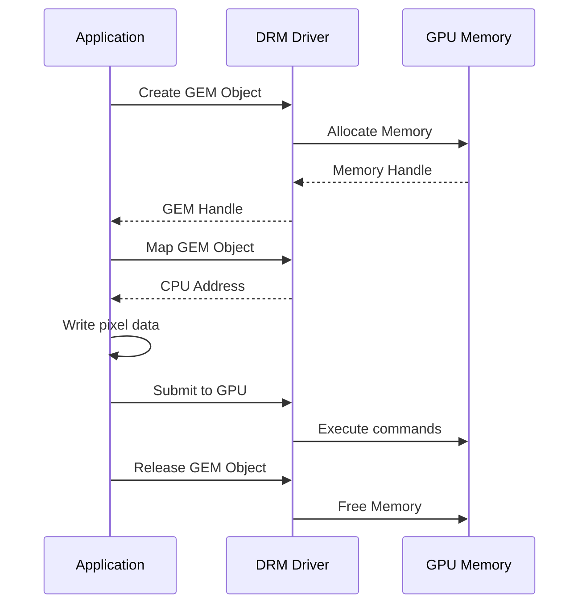
```mermaid
sequenceDiagram
    participant App as Application
    participant DRM as DRM Driver
    participant GPU as GPU Memory

    App->>DRM: Create GEM Object
    DRM->>GPU: Allocate Memory
    GPU-->>DRM: Memory Handle
    DRM-->>App: GEM Handle

    App->>DRM: Map GEM Object
    DRM-->>App: CPU Address

    App->>App: Write pixel data

    App->>DRM: Submit to GPU
    DRM->>GPU: Execute commands

    App->>DRM: Release GEM Object
    DRM->>GPU: Free Memory
```

**GEM Responsibilities:**
- Allocate/free GPU memory
- Provide CPU access to buffers (mmap)
- Share buffers between processes (via DMA-BUF)
- Track buffer usage
- Handle cache coherency

#### 3. **DMA-BUF (Buffer Sharing)**

DMA-BUF allows zero-copy buffer sharing between different devices and processes.

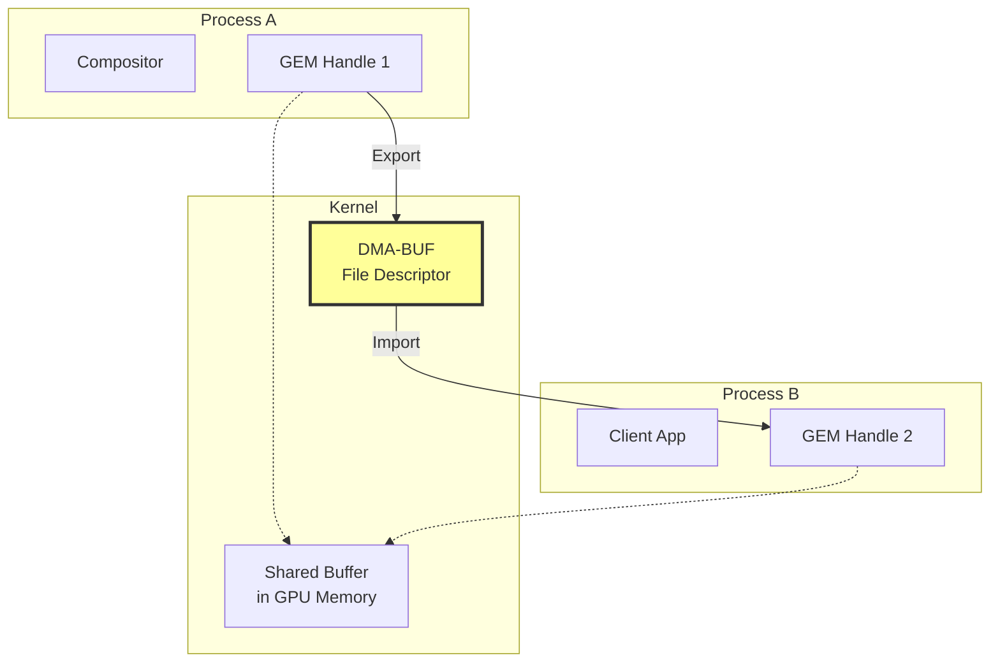
```mermaid
graph TB
    subgraph "Process A"
        APP1[Compositor]
        GEMH1[GEM Handle 1]
    end

    subgraph "Process B"
        APP2[Client App]
        GEMH2[GEM Handle 2]
    end

    subgraph "Kernel"
        DMABUF[DMA-BUF<br/>File Descriptor]
        BUFFER[Shared Buffer<br/>in GPU Memory]
    end

    GEMH1 -->|Export| DMABUF
    DMABUF -->|Import| GEMH2
    GEMH1 -.-> BUFFER
    GEMH2 -.-> BUFFER

    style DMABUF fill:#ff9,stroke:#333,stroke-width:3px
```

---

## Userspace Layer

### Wayland Protocol Architecture

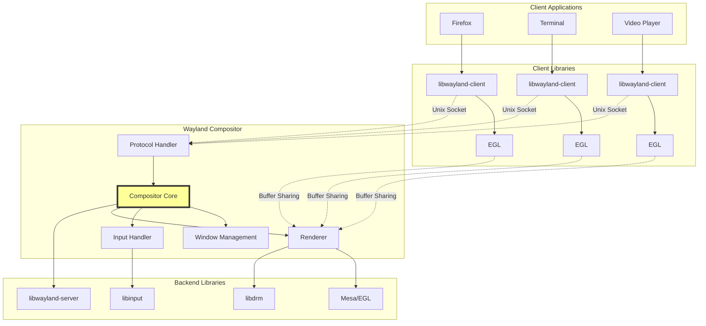
```mermaid
graph TB
    subgraph "Client Applications"
        APP1[Firefox]
        APP2[Terminal]
        APP3[Video Player]
    end

    subgraph "Client Libraries"
        LIBWAYLAND1[libwayland-client]
        LIBWAYLAND2[libwayland-client]
        LIBWAYLAND3[libwayland-client]
        EGL1[EGL]
        EGL2[EGL]
        EGL3[EGL]
    end

    subgraph "Wayland Compositor"
        COMP[Compositor Core]
        PROTO[Protocol Handler]
        WM[Window Management]
        INPUT[Input Handler]
        RENDER[Renderer]
    end

    subgraph "Backend Libraries"
        LIBWSERVER[libwayland-server]
        MESA[Mesa/EGL]
        LIBINPUT[libinput]
        LIBDRM[libdrm]
    end

    APP1 --> LIBWAYLAND1
    APP2 --> LIBWAYLAND2
    APP3 --> LIBWAYLAND3

    LIBWAYLAND1 --> EGL1
    LIBWAYLAND2 --> EGL2
    LIBWAYLAND3 --> EGL3

    LIBWAYLAND1 -.Unix Socket.-> PROTO
    LIBWAYLAND2 -.Unix Socket.-> PROTO
    LIBWAYLAND3 -.Unix Socket.-> PROTO

    EGL1 -.Buffer Sharing.-> RENDER
    EGL2 -.Buffer Sharing.-> RENDER
    EGL3 -.Buffer Sharing.-> RENDER

    PROTO --> COMP
    COMP --> WM
    COMP --> INPUT
    COMP --> RENDER

    COMP --> LIBWSERVER
    INPUT --> LIBINPUT
    RENDER --> MESA
    RENDER --> LIBDRM

    style COMP fill:#ff9,stroke:#333,stroke-width:4px
```

### How Wayland Works (Simplified)

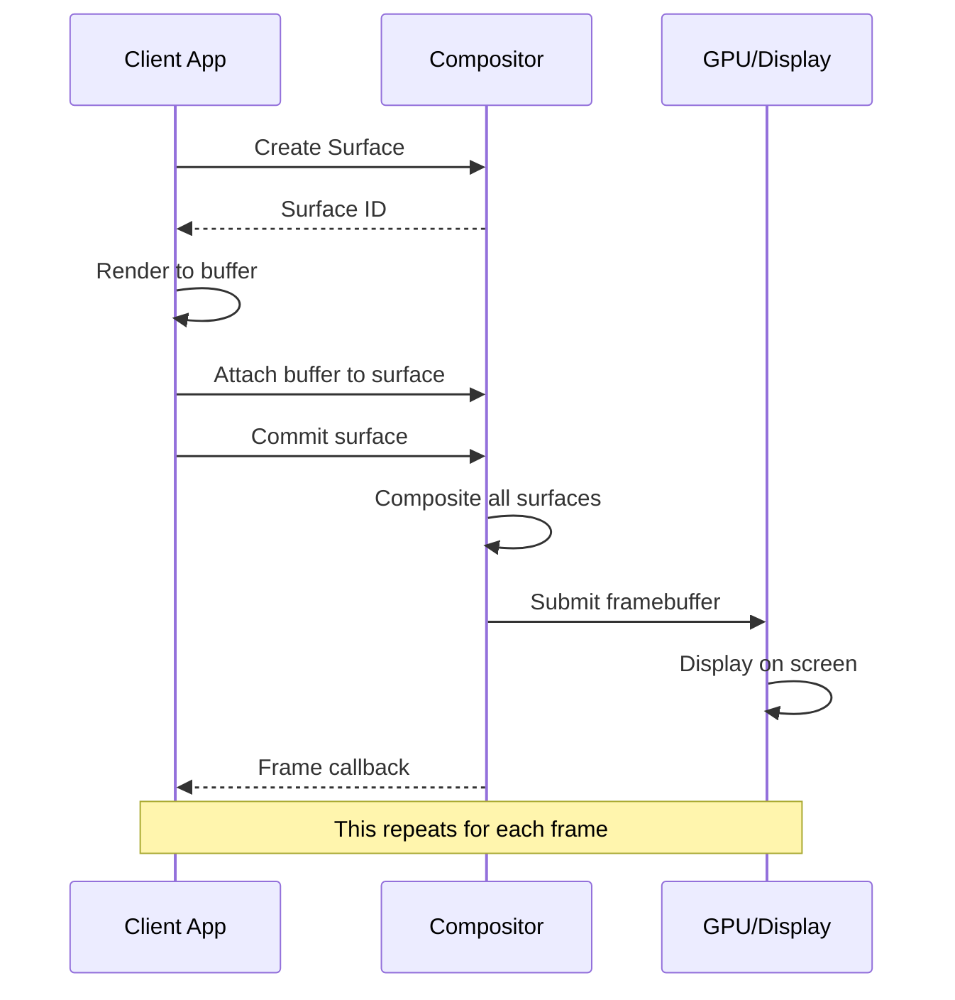
```mermaid
sequenceDiagram
    participant Client as Client App
    participant Comp as Compositor
    participant GPU as GPU/Display

    Client->>Comp: Create Surface
    Comp-->>Client: Surface ID

    Client->>Client: Render to buffer
    Client->>Comp: Attach buffer to surface
    Client->>Comp: Commit surface

    Comp->>Comp: Composite all surfaces
    Comp->>GPU: Submit framebuffer
    GPU->>GPU: Display on screen

    Comp-->>Client: Frame callback

    Note over Client,GPU: This repeats for each frame
```

### Compositor Responsibilities

A Wayland compositor must handle:

1. **Display Management**
   - Configure outputs (monitors)
   - Set display modes
   - Handle hot-plug events

2. **Window Management**
   - Position windows
   - Handle focus
   - Implement tiling/stacking logic
   - Provide window decorations (optional)

3. **Input Handling**
   - Receive input events from kernel
   - Route events to appropriate clients
   - Handle compositor shortcuts

4. **Rendering**
   - Composite client buffers
   - Apply effects (shadows, transparency)
   - Render to framebuffer

5. **Protocol Implementation**
   - Wayland core protocol
   - Extension protocols (xdg-shell, layer-shell, etc.)

---

## Raspberry Pi OS Architecture

### Current State (2024+)

Raspberry Pi OS has transitioned from X11 to Wayland with the Labwc compositor.

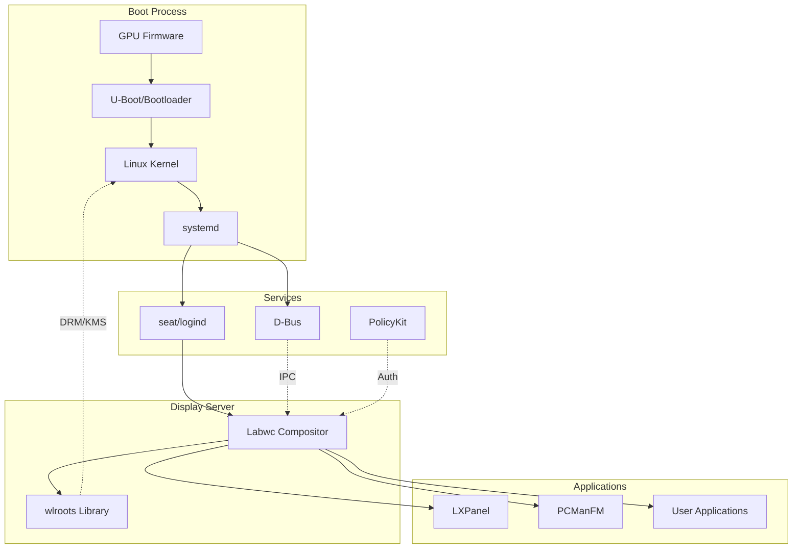
```mermaid
graph TB
    subgraph "Boot Process"
        FIRMWARE[GPU Firmware]
        UBOOT[U-Boot/Bootloader]
        KERNEL[Linux Kernel]
        SYSTEMD[systemd]
    end

    subgraph "Display Server"
        LABWC[Labwc Compositor]
        WLROOTS[wlroots Library]
    end

    subgraph "Services"
        DBUS[D-Bus]
        POLKIT[PolicyKit]
        SEAT[seat/logind]
    end

    subgraph "Applications"
        LXPANEL[LXPanel]
        PCMANFM[PCManFM]
        APPS[User Applications]
    end

    FIRMWARE --> UBOOT
    UBOOT --> KERNEL
    KERNEL --> SYSTEMD

    SYSTEMD --> SEAT
    SYSTEMD --> DBUS
    SEAT --> LABWC

    LABWC --> WLROOTS
    WLROOTS -.DRM/KMS.-> KERNEL

    LABWC --> LXPANEL
    LABWC --> PCMANFM
    LABWC --> APPS

    DBUS -.IPC.-> LABWC
    POLKIT -.Auth.-> LABWC
```

### Boot Sequence Detail

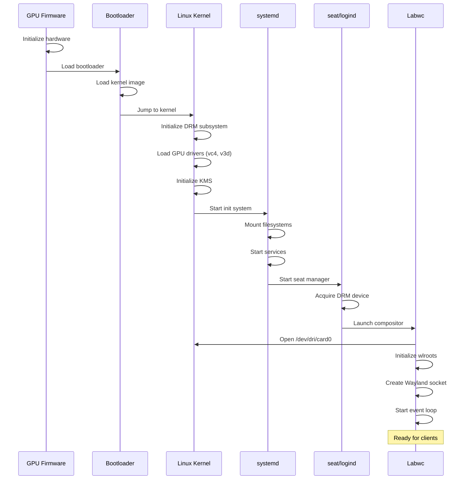
```mermaid
sequenceDiagram
    participant GPU as GPU Firmware
    participant Boot as Bootloader
    participant Kernel as Linux Kernel
    participant Init as systemd
    participant Seat as seat/logind
    participant Comp as Labwc

    GPU->>GPU: Initialize hardware
    GPU->>Boot: Load bootloader
    Boot->>Boot: Load kernel image
    Boot->>Kernel: Jump to kernel

    Kernel->>Kernel: Initialize DRM subsystem
    Kernel->>Kernel: Load GPU drivers (vc4, v3d)
    Kernel->>Kernel: Initialize KMS
    Kernel->>Init: Start init system

    Init->>Init: Mount filesystems
    Init->>Init: Start services
    Init->>Seat: Start seat manager

    Seat->>Seat: Acquire DRM device
    Seat->>Comp: Launch compositor

    Comp->>Kernel: Open /dev/dri/card0
    Comp->>Comp: Initialize wlroots
    Comp->>Comp: Create Wayland socket
    Comp->>Comp: Start event loop

    Note over Comp: Ready for clients
```

### Key System Services

1. **systemd**: Init system and service manager
2. **seat/logind**: Session management, device access control
3. **D-Bus**: Inter-process communication
4. **polkit**: Authorization framework

---

## Building Your Own Compositor

### Minimal Compositor Architecture

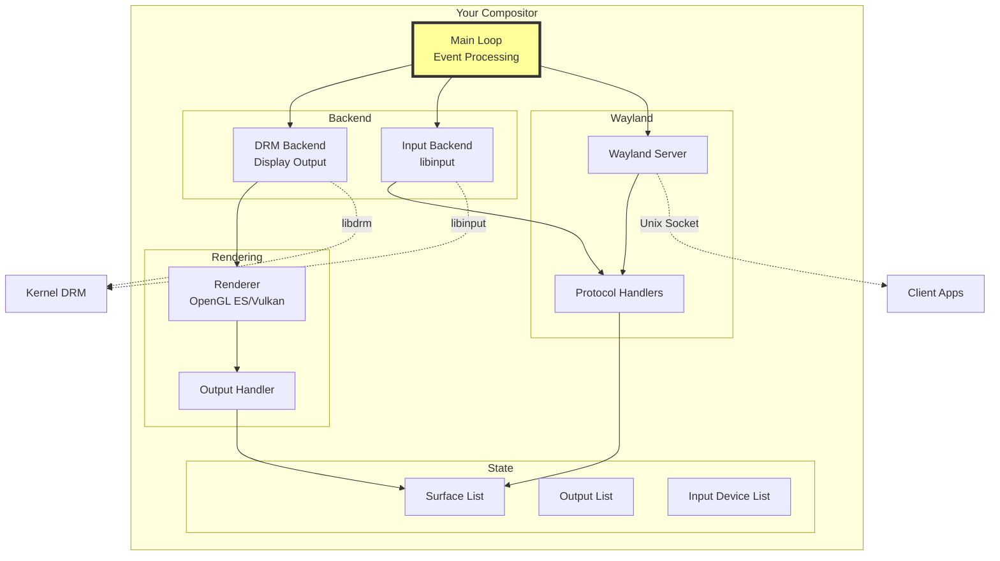
```mermaid
graph TB
    subgraph "Your Compositor"
        MAIN[Main Loop<br/>Event Processing]

        subgraph "Backend"
            DRM_BACKEND[DRM Backend<br/>Display Output]
            INPUT_BACKEND[Input Backend<br/>libinput]
        end

        subgraph "Rendering"
            RENDERER[Renderer<br/>OpenGL ES/Vulkan]
            OUTPUT[Output Handler]
        end

        subgraph "Wayland"
            WL_SERVER[Wayland Server]
            PROTOCOLS[Protocol Handlers]
        end

        subgraph "State"
            SURFACES[Surface List]
            OUTPUTS[Output List]
            INPUTS[Input Device List]
        end
    end

    MAIN --> DRM_BACKEND
    MAIN --> INPUT_BACKEND
    MAIN --> WL_SERVER

    DRM_BACKEND --> RENDERER
    RENDERER --> OUTPUT
    OUTPUT --> SURFACES

    INPUT_BACKEND --> PROTOCOLS
    WL_SERVER --> PROTOCOLS
    PROTOCOLS --> SURFACES

    DRM_BACKEND -.libdrm.-> KERNEL[Kernel DRM]
    INPUT_BACKEND -.libinput.-> KERNEL
    WL_SERVER -.Unix Socket.-> CLIENTS[Client Apps]

    style MAIN fill:#ff9,stroke:#333,stroke-width:4px
```

### Two Approaches to Building a Compositor

#### Approach 1: Using wlroots (Recommended for Beginners)

wlroots is a modular library that handles most low-level details.

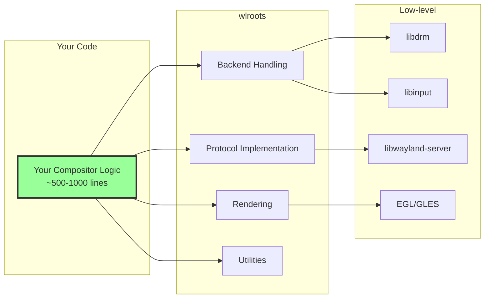
```mermaid
graph LR
    subgraph "Your Code"
        COMP[Your Compositor Logic<br/>~500-1000 lines]
    end

    subgraph "wlroots"
        BACKEND[Backend Handling]
        RENDERER[Rendering]
        PROTOCOLS[Protocol Implementation]
        UTILS[Utilities]
    end

    subgraph "Low-level"
        LIBDRM[libdrm]
        LIBINPUT[libinput]
        WAYLAND[libwayland-server]
        EGL[EGL/GLES]
    end

    COMP --> BACKEND
    COMP --> RENDERER
    COMP --> PROTOCOLS
    COMP --> UTILS

    BACKEND --> LIBDRM
    BACKEND --> LIBINPUT
    RENDERER --> EGL
    PROTOCOLS --> WAYLAND

    style COMP fill:#9f9,stroke:#333,stroke-width:3px
```

**Pros:**
- Much less code to write
- Handles many edge cases
- Good examples (sway, labwc, wayfire)
- Active development

**Cons:**
- Less control over low-level details
- Must follow wlroots patterns
- Abstracts away some first principles

#### Approach 2: From Scratch (For Deep Learning)

Build everything yourself using libdrm, libinput, and libwayland-server.

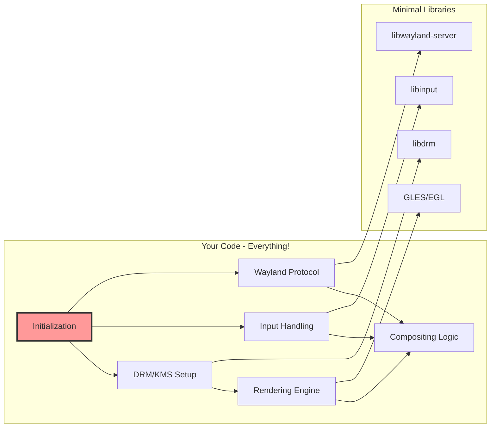
```mermaid
graph LR
    subgraph "Your Code - Everything!"
        INIT[Initialization]
        DRM[DRM/KMS Setup]
        RENDER[Rendering Engine]
        INPUT[Input Handling]
        WL[Wayland Protocol]
        COMP[Compositing Logic]
    end

    subgraph "Minimal Libraries"
        LIBDRM[libdrm]
        LIBINPUT[libinput]
        LIBWAYLAND[libwayland-server]
        GLES[GLES/EGL]
    end

    INIT --> DRM
    INIT --> INPUT
    INIT --> WL

    DRM --> RENDER
    RENDER --> COMP
    INPUT --> COMP
    WL --> COMP

    DRM --> LIBDRM
    INPUT --> LIBINPUT
    WL --> LIBWAYLAND
    RENDER --> GLES

    style INIT fill:#f99,stroke:#333,stroke-width:3px
```

**Pros:**
- Complete understanding of first principles
- Total control
- Learn every detail

**Cons:**
- Thousands of lines of code
- Many edge cases to handle
- Longer development time

---

## Implementation Roadmap

### Phase 1: Understanding the Current System

**Goal**: Understand how Labwc works on your Raspberry Pi

```bash
# Check current display server
echo $XDG_SESSION_TYPE  # Should show "wayland"

# List DRM devices
ls -la /dev/dri/

# Check which compositor is running
ps aux | grep labwc

# View kernel graphics drivers
lsmod | grep drm

# Check DRM device info
sudo cat /sys/kernel/debug/dri/0/name
```

### Phase 2: Minimal DRM Program

**Goal**: Open DRM device and set a mode

```c
// Pseudocode structure
int main() {
    // 1. Open DRM device
    int drm_fd = open("/dev/dri/card0", O_RDWR);

    // 2. Get resources (connectors, encoders, CRTCs)
    drmModeResPtr resources = drmModeGetResources(drm_fd);

    // 3. Find connected display
    drmModeConnectorPtr connector = ...;

    // 4. Create framebuffer
    struct drm_mode_create_dumb create = {...};
    drmIoctl(drm_fd, DRM_IOCTL_MODE_CREATE_DUMB, &create);

    // 5. Set mode (display something!)
    drmModeSetCrtc(drm_fd, crtc_id, fb_id, ...);

    // 6. Wait and cleanup
}
```

### Phase 3: Add Input Handling

```c
// Use libinput to handle keyboard/mouse
struct libinput *li = libinput_udev_create_context(...);
libinput_udev_assign_seat(li, "seat0");

// Event loop
while (1) {
    libinput_dispatch(li);
    struct libinput_event *event;
    while ((event = libinput_get_event(li))) {
        // Handle keyboard, mouse events
    }
}
```

### Phase 4: Implement Wayland Server

```c
// Create Wayland display
struct wl_display *display = wl_display_create();

// Add socket
wl_display_add_socket_auto(display);

// Implement protocols (compositor, xdg_shell, etc.)
// Handle client connections and surfaces

// Event loop
while (running) {
    wl_display_flush_clients(display);
    wl_event_loop_dispatch(loop, -1);
}
```

### Phase 5: Rendering and Compositing

```c
// For each frame:
// 1. Clear framebuffer
// 2. For each visible surface (window):
//    - Bind texture from client buffer
//    - Render quad with texture
// 3. Apply effects (if any)
// 4. Submit to display
```

### Technology Stack for Custom Compositor

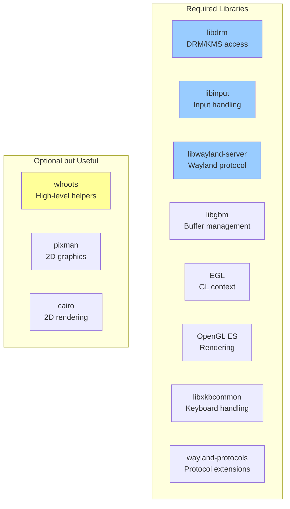
```mermaid
graph TB
    subgraph "Required Libraries"
        LIBDRM[libdrm<br/>DRM/KMS access]
        LIBINPUT[libinput<br/>Input handling]
        LIBWAYLAND[libwayland-server<br/>Wayland protocol]
        LIBGBM[libgbm<br/>Buffer management]
        EGL[EGL<br/>GL context]
        GLES[OpenGL ES<br/>Rendering]
        LIBXKBCOMMON[libxkbcommon<br/>Keyboard handling]
        WAYLAND_PROTOCOLS[wayland-protocols<br/>Protocol extensions]
    end

    subgraph "Optional but Useful"
        WLROOTS[wlroots<br/>High-level helpers]
        PIXMAN[pixman<br/>2D graphics]
        CAIRO[cairo<br/>2D rendering]
    end

    style LIBDRM fill:#9cf
    style LIBINPUT fill:#9cf
    style LIBWAYLAND fill:#9cf
    style WLROOTS fill:#ff9
```

---

## Key Concepts: First Principles

### 1. Everything is About Buffers

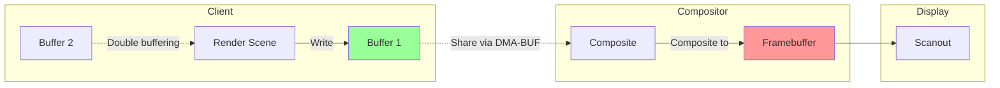
```mermaid
graph LR
    subgraph "Client"
        RENDER1[Render Scene]
        BUF1[Buffer 1]
        BUF2[Buffer 2]
    end

    subgraph "Compositor"
        COMP[Composite]
        FB[Framebuffer]
    end

    subgraph "Display"
        SCAN[Scanout]
    end

    RENDER1 -->|Write| BUF1
    BUF1 -.Share via DMA-BUF.-> COMP
    BUF2 -.Double buffering.-> RENDER1

    COMP -->|Composite to| FB
    FB --> SCAN

    style BUF1 fill:#9f9
    style FB fill:#f99
```

**Key Insight**: Graphics is about managing and moving pixel buffers efficiently:
- Applications render to buffers
- Compositor composites multiple buffers into one
- Display hardware scans out the final buffer

### 2. Memory is Shared, Not Copied

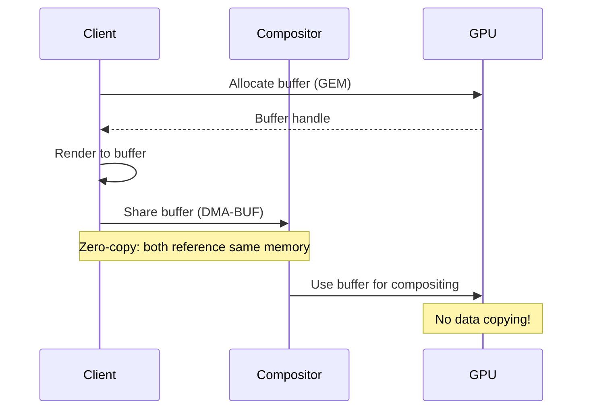
```mermaid
sequenceDiagram
    participant Client
    participant Compositor
    participant GPU

    Client->>GPU: Allocate buffer (GEM)
    GPU-->>Client: Buffer handle

    Client->>Client: Render to buffer

    Client->>Compositor: Share buffer (DMA-BUF)

    Note over Client,Compositor: Zero-copy: both reference same memory

    Compositor->>GPU: Use buffer for compositing

    Note over GPU: No data copying!
```

### 3. Mode Setting Determines What You See

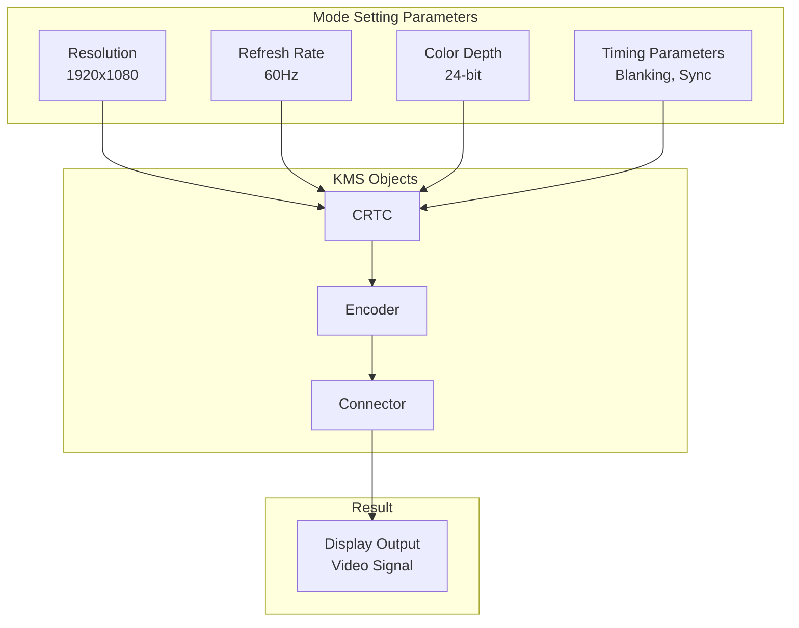
```mermaid
graph TB
    subgraph "Mode Setting Parameters"
        RES[Resolution<br/>1920x1080]
        REFRESH[Refresh Rate<br/>60Hz]
        DEPTH[Color Depth<br/>24-bit]
        TIMING[Timing Parameters<br/>Blanking, Sync]
    end

    subgraph "KMS Objects"
        CRTC[CRTC]
        ENCODER[Encoder]
        CONNECTOR[Connector]
    end

    subgraph "Result"
        OUTPUT[Display Output<br/>Video Signal]
    end

    RES --> CRTC
    REFRESH --> CRTC
    DEPTH --> CRTC
    TIMING --> CRTC

    CRTC --> ENCODER
    ENCODER --> CONNECTOR
    CONNECTOR --> OUTPUT
```

### 4. Synchronization is Critical

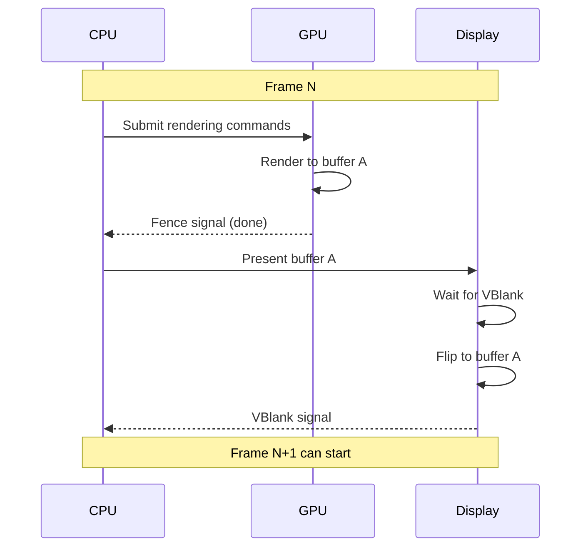
```mermaid
sequenceDiagram
    participant CPU
    participant GPU
    participant Display

    Note over CPU,Display: Frame N

    CPU->>GPU: Submit rendering commands
    GPU->>GPU: Render to buffer A
    GPU-->>CPU: Fence signal (done)

    CPU->>Display: Present buffer A

    Display->>Display: Wait for VBlank
    Display->>Display: Flip to buffer A
    Display-->>CPU: VBlank signal

    Note over CPU,Display: Frame N+1 can start
```

**Fences**: Synchronization primitives that signal when GPU work is complete.
**VBlank**: Vertical blanking interval - safe time to update display.

---

## Next Steps: Practical Implementation

### Recommended Learning Path

1. **Week 1-2: Study Existing Code**
   - Read Labwc source code
   - Study wlroots examples
   - Understand DRM/KMS API

2. **Week 3-4: Minimal DRM Program**
   - Open DRM device
   - List outputs
   - Set a mode
   - Display solid color

3. **Week 5-6: Add Rendering**
   - Initialize EGL
   - Render with OpenGL ES
   - Implement double buffering

4. **Week 7-8: Input Events**
   - Use libinput
   - Handle keyboard/mouse
   - Implement basic cursor

5. **Week 9-12: Wayland Server**
   - Create Wayland display
   - Implement core protocol
   - Handle client surfaces

6. **Week 13+: Full Compositor**
   - Window management
   - Protocol extensions
   - Effects and polish

### Essential Resources

- **Linux Kernel DRM Documentation**: https://www.kernel.org/doc/html/latest/gpu/
- **Wayland Protocol**: https://wayland.freedesktop.org/docs/html/
- **wlroots Examples**: https://gitlab.freedesktop.org/wlroots/wlroots
- **Labwc Source**: https://github.com/labwc/labwc
- **LWN Articles**: "The Linux graphics stack in a nutshell"

### Development Environment Setup

```bash
# Install development dependencies
sudo apt update
sudo apt install \
    build-essential \
    meson ninja-build \
    libwayland-dev \
    wayland-protocols \
    libdrm-dev \
    libgbm-dev \
    libinput-dev \
    libxkbcommon-dev \
    libegl1-mesa-dev \
    libgles2-mesa-dev \
    libpixman-1-dev \
    pkg-config

# Optional: Install wlroots for reference
sudo apt install libwlroots-dev

# Clone examples
git clone https://github.com/swaywm/wlroots
cd wlroots/examples
```

### Testing Your Compositor

```bash
# Run from TTY (not from existing graphical session)
# Ctrl+Alt+F3 to switch to TTY

# Set environment
export XDG_RUNTIME_DIR=/run/user/$(id -u)
export WLR_BACKENDS=drm
export WLR_RENDERER=gles2

# Run your compositor
./my_compositor

# From another TTY or SSH session, run a client:
WAYLAND_DISPLAY=wayland-0 weston-terminal
```

---

## Conclusion

Building a compositor from scratch is an ambitious project that requires understanding:

1. **Hardware**: How GPUs and display controllers work
2. **Kernel**: DRM/KMS subsystem, memory management
3. **Userspace**: Wayland protocol, rendering APIs
4. **Integration**: How all layers communicate

The key is to **start small**:
- First, just display a colored rectangle via DRM
- Then add rendering with OpenGL
- Then add input handling
- Finally implement the Wayland protocol

Each step builds on first principles, and you'll gain deep understanding of how modern graphics systems work.

**Remember**: Even "simple" compositors like Labwc are thousands of lines of code handling countless edge cases. But understanding the architecture and core concepts makes it achievable.

Good luck building your compositor!
