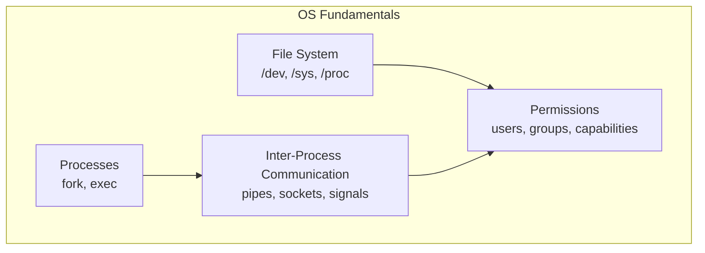
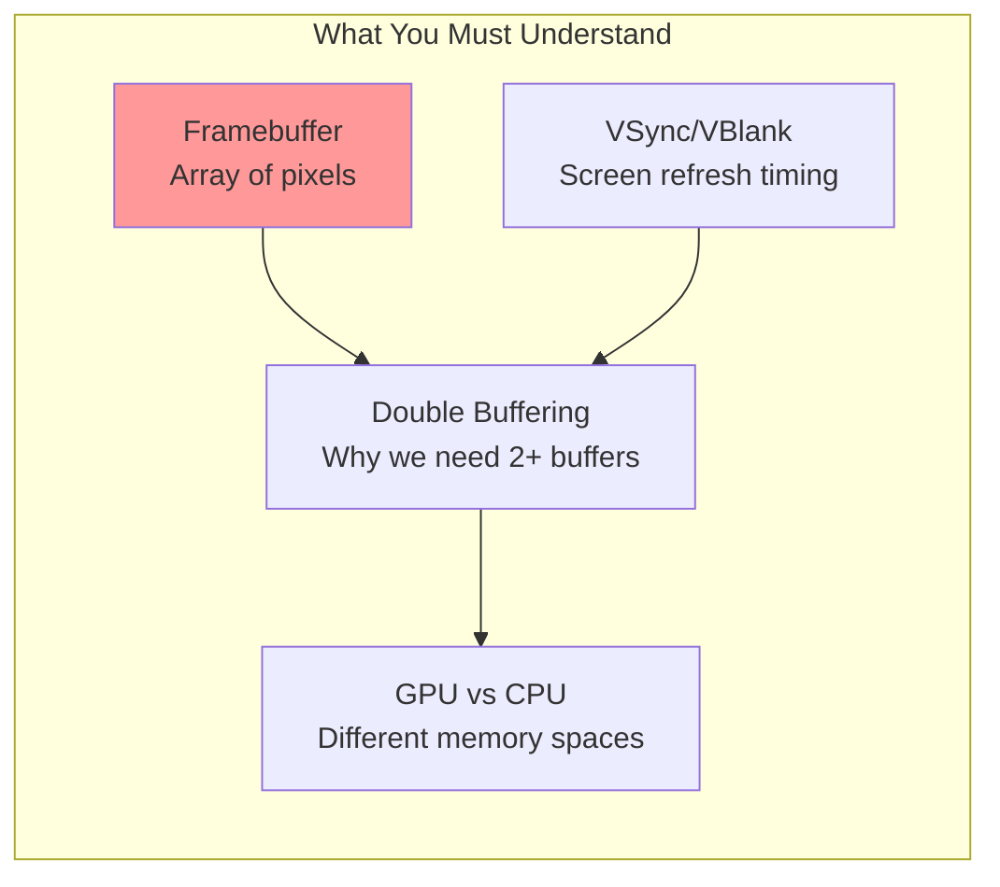
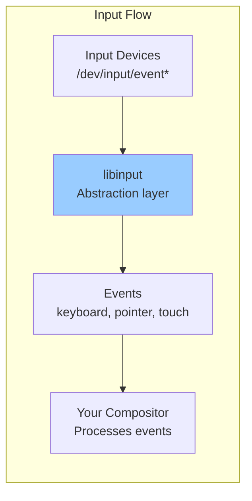
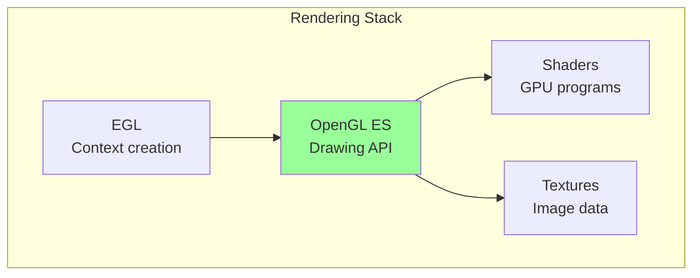
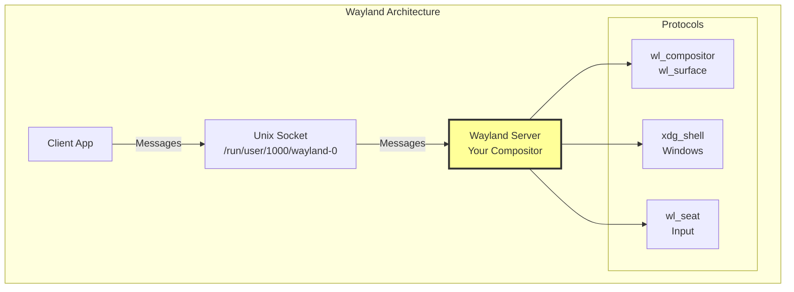
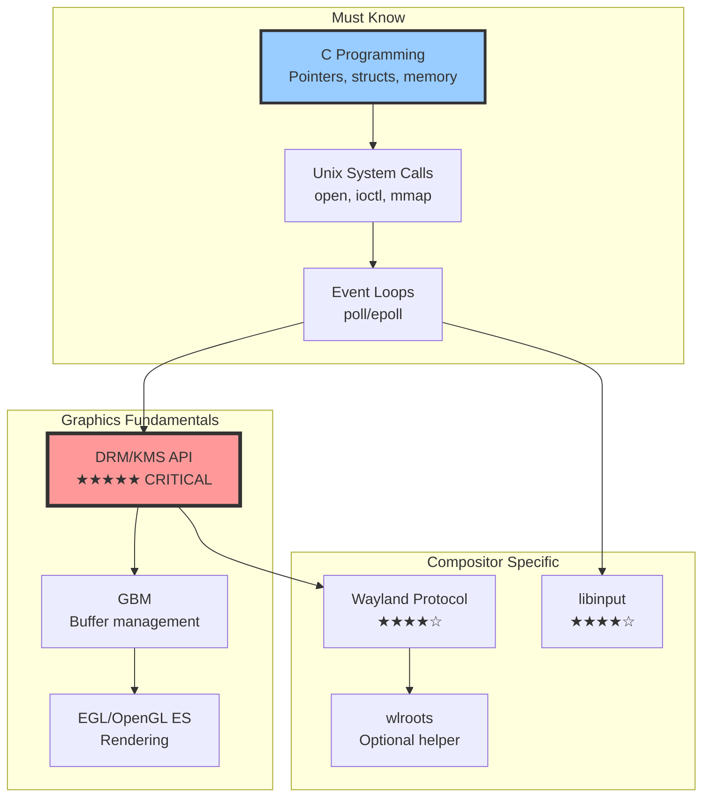

# Wayland Compositor Fundamentals: What You Actually Need to Know

## Important Clarification

**Your friend is incorrect** - Raspberry Pi OS is **NOT** built on XFCE. Here's what's actually running:

- **Desktop Environment**: LXDE-based (uses LXPanel, PCManFM)
- **Compositor**: **Labwc** (Wayland compositor based on wlroots)
- **Previously**: Used Wayfire, and before that, Openbox (X11)

Let me show you how to check what you actually have.

---

## Step 1: Check Your Current System

Since you're in CLI mode, let's figure out what's installed and what's running:

```bash
# Check if you have a desktop environment installed
dpkg -l | grep -E "lxde|xfce|labwc|wayfire"

# Check what display server packages are installed
dpkg -l | grep -E "wayland|xorg"

# See what's in your session type
echo $XDG_SESSION_TYPE

# Check if compositor is running
ps aux | grep -E "labwc|wayfire|openbox|xfce"

# Check DRM devices (GPU access)
ls -la /dev/dri/

# See what graphics driver is loaded
lsmod | grep drm
```

Run these commands and tell me what you see. This will tell us exactly what you have.

---

## The Absolute Fundamentals You Need

To build on top of Wayland (or build your own compositor), you need to understand these concepts **in order**:

### Level 0: Operating System Basics (You probably know these)



**Why you need this:**
- Compositor opens device files (`/dev/dri/card0`, `/dev/input/event*`)
- Must understand Unix sockets (Wayland uses them)
- Need proper permissions to access GPU and input devices

### Level 1: Graphics Hardware Fundamentals



**Core concepts:**

1. **Framebuffer**: Just a big array of pixels in memory
   ```
   Width: 1920 pixels
   Height: 1080 pixels
   Format: XRGB8888 (32 bits per pixel)
   Total size: 1920 × 1080 × 4 bytes = 8,294,400 bytes (~8MB)
   ```

2. **VBlank (Vertical Blank)**:
   - Screen refreshes 60 times per second
   - There's a brief moment between frames (VBlank) when it's safe to update
   - If you update mid-frame, you get tearing

3. **Double Buffering**:
   ```
   Front Buffer: What's being displayed
   Back Buffer: What you're drawing to

   When done drawing:
   - Wait for VBlank
   - Swap buffers (now back becomes front)
   ```

### Level 2: Linux DRM/KMS API (Critical!)

This is the **most important** layer. Everything else builds on this.

```mermaid
graph TB
    subgraph "DRM Core Concepts"
        DEVICE[Device File<br/>/dev/dri/card0]
        IOCTL[ioctl() calls<br/>How you talk to kernel]

        subgraph "KMS Objects"
            CONN[Connector<br/>Physical port]
            CRTC[CRTC<br/>Scanout engine]
            PLANE[Plane<br/>Image layer]
            FB[Framebuffer<br/>Memory buffer]
        end

        subgraph "Memory"
            GEM[GEM Handle<br/>GPU buffer reference]
            DUMB[Dumb Buffer<br/>CPU-accessible]
            PRIME[PRIME/DMA-BUF<br/>Sharing between processes]
        end
    end

    DEVICE --> IOCTL
    IOCTL --> CONN
    IOCTL --> CRTC
    IOCTL --> PLANE
    IOCTL --> FB
    IOCTL --> GEM

    FB --> GEM
    PLANE --> FB
    PLANE --> CRTC
    CRTC --> CONN

    style IOCTL fill:#ff9,stroke:#333,stroke-width:3px
```

**What you need to learn:**

1. **Opening DRM device**:
   ```c
   int fd = open("/dev/dri/card0", O_RDWR | O_CLOEXEC);
   ```

2. **Getting resources**:
   ```c
   drmModeRes *resources = drmModeGetResources(fd);
   // Returns: connectors, CRTCs, encoders
   ```

3. **Finding connected display**:
   ```c
   for (each connector) {
       if (connector->connection == DRM_MODE_CONNECTED) {
           // Found a connected monitor!
       }
   }
   ```

4. **Creating a buffer**:
   ```c
   struct drm_mode_create_dumb create = {
       .width = 1920,
       .height = 1080,
       .bpp = 32  // bits per pixel
   };
   ioctl(fd, DRM_IOCTL_MODE_CREATE_DUMB, &create);
   ```

5. **Displaying it**:
   ```c
   drmModeSetCrtc(fd, crtc_id, fb_id, 0, 0,
                  &connector_id, 1, mode);
   ```

### Level 3: Input Handling (libinput)



**What you need:**

1. **Setup**:
   ```c
   struct libinput *li = libinput_udev_create_context(&interface, NULL, udev);
   libinput_udev_assign_seat(li, "seat0");
   ```

2. **Event loop**:
   ```c
   while (1) {
       libinput_dispatch(li);
       while ((event = libinput_get_event(li))) {
           switch (libinput_event_get_type(event)) {
               case LIBINPUT_EVENT_KEYBOARD_KEY:
                   // Handle keyboard
                   break;
               case LIBINPUT_EVENT_POINTER_MOTION:
                   // Handle mouse movement
                   break;
           }
       }
   }
   ```

### Level 4: OpenGL ES / Rendering



**Basics you need:**

1. **Create EGL context** (connects OpenGL to DRM):
   ```c
   EGLDisplay display = eglGetDisplay(gbm_device);
   eglInitialize(display, NULL, NULL);
   ```

2. **Simple rendering**:
   ```c
   glClearColor(1.0, 0.0, 0.0, 1.0);  // Red
   glClear(GL_COLOR_BUFFER_BIT);
   ```

3. **Drawing a texture (window content)**:
   ```c
   glBindTexture(GL_TEXTURE_2D, texture_id);
   glDrawArrays(GL_TRIANGLE_STRIP, 0, 4);
   ```

### Level 5: Wayland Protocol



**Protocol basics**:

1. **Client creates surface**:
   ```
   Client -> Server: wl_compositor.create_surface()
   Server -> Client: surface_id = 5
   ```

2. **Client attaches buffer**:
   ```
   Client -> Server: wl_surface.attach(buffer)
   Client -> Server: wl_surface.commit()
   ```

3. **Server composites and displays**:
   ```
   Server: Composite all surfaces -> framebuffer -> display
   ```

---

## Practical Learning Path: Start Simple!

### Experiment 1: Pure DRM - Display a Color (No Wayland!)

This is your **first** experiment. Get this working before anything else.

```c
// minimal_drm.c - Display a red screen
#include <fcntl.h>
#include <stdio.h>
#include <xf86drm.h>
#include <xf86drmMode.h>
#include <string.h>
#include <unistd.h>
#include <stdint.h>

int main() {
    // 1. Open DRM device
    int fd = open("/dev/dri/card0", O_RDWR | O_CLOEXEC);
    if (fd < 0) {
        perror("Cannot open /dev/dri/card0");
        return 1;
    }

    // 2. Get resources
    drmModeRes *resources = drmModeGetResources(fd);
    if (!resources) {
        fprintf(stderr, "Cannot get resources\n");
        return 1;
    }

    // 3. Find connected connector
    drmModeConnector *connector = NULL;
    for (int i = 0; i < resources->count_connectors; i++) {
        connector = drmModeGetConnector(fd, resources->connectors[i]);
        if (connector->connection == DRM_MODE_CONNECTED) {
            printf("Found connected display!\n");
            break;
        }
        drmModeFreeConnector(connector);
        connector = NULL;
    }

    if (!connector) {
        fprintf(stderr, "No connected display found\n");
        return 1;
    }

    // 4. Get mode (resolution)
    drmModeModeInfo mode = connector->modes[0];
    printf("Mode: %dx%d\n", mode.hdisplay, mode.vdisplay);

    // 5. Create dumb buffer (CPU-accessible)
    struct drm_mode_create_dumb create = {
        .width = mode.hdisplay,
        .height = mode.vdisplay,
        .bpp = 32
    };
    drmIoctl(fd, DRM_IOCTL_MODE_CREATE_DUMB, &create);

    // 6. Create framebuffer
    uint32_t fb_id;
    drmModeAddFB(fd, mode.hdisplay, mode.vdisplay, 24, 32,
                 create.pitch, create.handle, &fb_id);

    // 7. Map buffer to CPU memory
    struct drm_mode_map_dumb map = { .handle = create.handle };
    drmIoctl(fd, DRM_IOCTL_MODE_MAP_DUMB, &map);

    uint32_t *pixels = mmap(0, create.size, PROT_READ | PROT_WRITE,
                            MAP_SHARED, fd, map.offset);

    // 8. Fill with RED color
    for (uint32_t i = 0; i < create.size / 4; i++) {
        pixels[i] = 0x00FF0000;  // XRGB: Red
    }

    // 9. Set the mode and display!
    drmModeSetCrtc(fd, resources->crtcs[0], fb_id, 0, 0,
                   &connector->connector_id, 1, &mode);

    printf("Red screen displayed! Press Enter to exit...\n");
    getchar();

    // Cleanup
    munmap(pixels, create.size);
    drmModeRmFB(fd, fb_id);
    drmModeFreeConnector(connector);
    drmModeFreeResources(resources);
    close(fd);

    return 0;
}
```

**Compile and run**:
```bash
# Install dependencies
sudo apt install libdrm-dev

# Compile
gcc minimal_drm.c -o minimal_drm -ldrm

# Run (must be root or in video group)
sudo ./minimal_drm
```

**What this teaches you:**
- Direct hardware access
- How buffers work
- The DRM API basics
- No abstractions!

### Experiment 2: Add Input

```c
// Add libinput to previous example
#include <libinput.h>
#include <libudev.h>

// Setup
struct udev *udev = udev_new();
struct libinput *li = libinput_udev_create_context(&interface, NULL, udev);
libinput_udev_assign_seat(li, "seat0");

// In your main loop:
while (running) {
    libinput_dispatch(li);
    struct libinput_event *event;
    while ((event = libinput_get_event(li))) {
        if (libinput_event_get_type(event) == LIBINPUT_EVENT_KEYBOARD_KEY) {
            struct libinput_event_keyboard *k =
                libinput_event_get_keyboard_event(event);

            if (libinput_event_keyboard_get_key_state(k) ==
                LIBINPUT_KEY_STATE_PRESSED) {
                printf("Key pressed!\n");
                running = 0;  // Exit on any key
            }
        }
    }
}
```

### Experiment 3: Simple Wayland Compositor (Using wlroots)

Now that you understand the basics, use wlroots to build a simple compositor:

```c
// tinywl.c - Minimal compositor example
#include <wlr/backend.h>
#include <wlr/render/wlr_renderer.h>
#include <wlr/types/wlr_compositor.h>
#include <wlr/types/wlr_xdg_shell.h>

struct tiny_server {
    struct wl_display *wl_display;
    struct wlr_backend *backend;
    struct wlr_renderer *renderer;
    struct wlr_compositor *compositor;
};

int main() {
    struct tiny_server server = {0};

    // Create Wayland display
    server.wl_display = wl_display_create();

    // Create backend (handles DRM + input)
    server.backend = wlr_backend_autocreate(server.wl_display);

    // Create renderer
    server.renderer = wlr_backend_get_renderer(server.backend);
    wlr_renderer_init_wl_display(server.renderer, server.wl_display);

    // Create compositor
    server.compositor = wlr_compositor_create(
        server.wl_display, server.renderer);

    // Add socket for clients to connect
    const char *socket = wl_display_add_socket_auto(server.wl_display);
    printf("Running on WAYLAND_DISPLAY=%s\n", socket);

    // Start backend
    wlr_backend_start(server.backend);

    // Run event loop
    wl_display_run(server.wl_display);

    return 0;
}
```

---

## Your Immediate Action Plan

### Step 1: Boot into GUI (if you want to see what's there)

```bash
# Start the GUI from CLI
startx
# OR
sudo systemctl start lightdm
# OR (if using systemd graphical target)
sudo systemctl isolate graphical.target
```

### Step 2: Explore What's Running

```bash
# Check what compositor is active
ps aux | grep -E "labwc|wayfire|weston"

# See Wayland socket
ls -la $XDG_RUNTIME_DIR/wayland-*

# List all Wayland clients
sudo apt install weston
weston-info
```

### Step 3: Start Building

Choice A: **Build on top of existing compositor** (easier)
- Learn Labwc's configuration and plugin system
- Study its source: https://github.com/labwc/labwc

Choice B: **Build from scratch** (learn fundamentals)
- Start with minimal_drm.c example above
- Add features incrementally

---

## The Core Skills Matrix



## Essential Reading (In Order!)

1. **Start here**: "The Linux graphics stack in a nutshell" (LWN.net)
2. **DRM Documentation**: https://www.kernel.org/doc/html/latest/gpu/
3. **Wayland Book**: https://wayland-book.com/
4. **wlroots examples**: Study tinywl.c in wlroots source
5. **Labwc source code**: Real-world compositor

---

## Summary: What You REALLY Need

The absolute minimum to build a working compositor:

1. ✅ **C programming** - pointers, structs, file I/O
2. ✅ **DRM/KMS** - 80% of your effort should go here!
3. ✅ **libinput** - For keyboard/mouse
4. ✅ **EGL/OpenGL ES** - For rendering
5. ✅ **Wayland protocol** - Communication with clients
6. ✅ **Event loops** - poll(), epoll, or use wl_event_loop

Everything else is either:
- **Helper libraries** (wlroots, pixman) - nice to have
- **Higher-level abstractions** - XFCE, LXDE (not what you're building)

**Start with the minimal_drm.c example I gave you.** Get that working first. Once you can display a colored rectangle, you understand the fundamentals. Everything else builds on that.

Want me to help you set up your environment and get that first example running?
