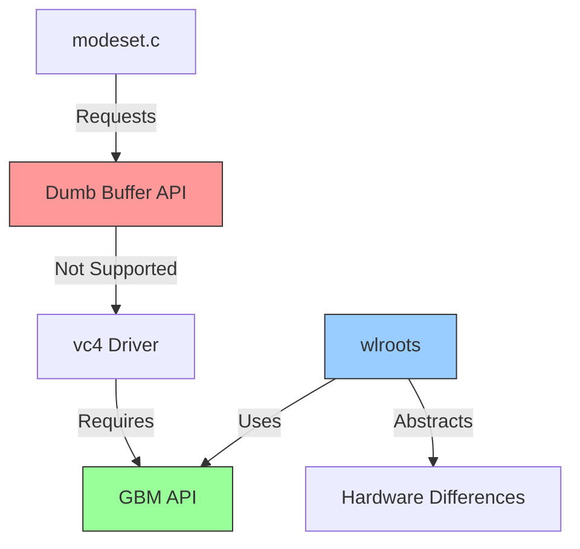
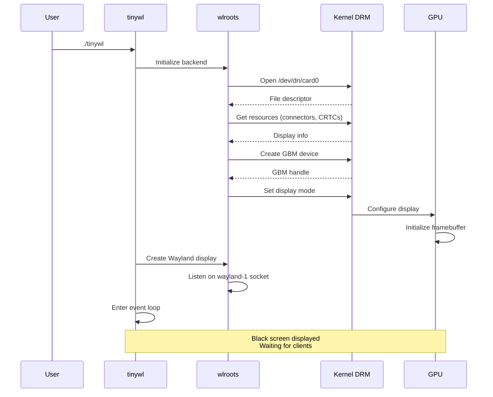

# Compositor Session Log - First Run

## System Configuration

**Hardware:** Raspberry Pi
**GPU Driver:** vc4 (VideoCore)
**DRM Device:** `/dev/dri/card0` (accessible, video group)
**Wayland Version:** 1.23.1

## What We Did

### 1. Verified DRM Access

```bash
ls -la /dev/dri/card0
# Output: crw-rw----+ 1 root video 226, 0 Nov 15 20:23 /dev/dri/card0
# ✓ Device exists, video group has r/w access
```

### 2. Attempted Traditional DRM Example

**Goal:** Run `modeset.c` (dvdhrm's classic DRM tutorial)

**Issue 1:** Missing headers
```bash
# Error: drm.h: No such file or directory
# Solution: Headers in /usr/include/libdrm/, not /usr/include/
```

**Issue 2:** Raspberry Pi hardware limitation
```bash
sudo ./modeset
# Error: "does not support dumb buffers"
# Error code: 95 (EOPNOTSUPP)
```

**Root Cause:** vc4 driver requires GBM (Generic Buffer Management), not simple dumb buffers.



### 3. Switched to wlroots

**Installation:**
```bash
sudo apt install meson ninja-build libwayland-dev \
    wayland-protocols libegl1-mesa-dev libgles2-mesa-dev \
    libgbm-dev libinput-dev libxkbcommon-dev \
    libpixman-1-dev libseat-dev hwdata

git clone https://gitlab.freedesktop.org/wlroots/wlroots.git
cd wlroots
git checkout 0.17.4  # Compatible with wayland 1.23
meson setup build/
ninja -C build/
```

**Why 0.17.4?** Latest wlroots requires wayland-server >=1.24, system has 1.23.1.

### 4. First Compositor Run

```bash
cd ~/wlroots/build/tinywl
./tinywl
```

**Result:** Black screen (SUCCESS - compositor running, waiting for clients)

## Architecture Overview

```mermaid
graph TB
    subgraph "What We Built"
        TINYWL[tinywl Compositor]
    end

    subgraph "wlroots Layer"
        BACKEND[DRM Backend]
        RENDER[Renderer]
        INPUT[Input Handler]
        PROTO[Protocol Handler]
    end

    subgraph "Kernel/Hardware"
        DRM[DRM/KMS]
        GBM[GBM]
        GPU[vc4 GPU Driver]
        DEVICE[/dev/dri/card0]
    end

    TINYWL --> BACKEND
    TINYWL --> RENDER
    TINYWL --> INPUT
    TINYWL --> PROTO

    BACKEND --> DRM
    RENDER --> GBM
    GBM --> GPU
    DRM --> DEVICE
    GPU --> DEVICE

    style TINYWL fill:#ff9,stroke:#333,stroke-width:3px
    style GPU fill:#f96,stroke:#333
```

## Key Learnings

### Hardware Constraints
- Raspberry Pi vc4 driver: **No dumb buffer support**
- Requires: **GBM + EGL** for buffer management
- Legacy tutorials (modeset.c) won't work as-is

### Dependency Hierarchy
```
tinywl (compositor)
    └── wlroots (abstraction library)
        ├── libwayland-server (protocol)
        ├── libgbm (buffer management)
        ├── libinput (input handling)
        └── libdrm (kernel interface)
            └── /dev/dri/card0 (hardware)
```

### Why wlroots?
- Abstracts hardware differences (GBM vs dumb buffers)
- Handles Wayland protocol complexity
- ~300 lines vs ~3000+ lines from scratch
- Production-ready (used by Sway, Labwc)

## Technical Details

### DRM Device Info
```
Path: /dev/dri/card0
Driver: vc4 (Broadcom VideoCore)
Major: 226, Minor: 0
Permissions: crw-rw----+ (video group)
```

### Compositor State
```
Display Server: Wayland
Backend: DRM
Renderer: OpenGL ES
Input: libinput
Socket: /run/user/1000/wayland-1
```

## Next Steps

### Immediate
1. Launch client app in compositor:
   ```bash
   WAYLAND_DISPLAY=wayland-1 weston-terminal
   ```

2. Exit compositor: `Alt + Escape` or `pkill tinywl`

### Learning Path
1. Study `tinywl.c` source (~500 lines)
2. Modify rendering (change background color)
3. Add keyboard shortcuts
4. Implement window management logic

### Code Locations
```
Compositor binary: ~/wlroots/build/tinywl/tinywl
Source code: ~/wlroots/tinywl/tinywl.c
wlroots lib: ~/wlroots/build/libwlroots.so
```

## Command Reference

```bash
# Start compositor
cd ~/wlroots/build/tinywl && ./tinywl

# Launch app (from another terminal/SSH)
WAYLAND_DISPLAY=wayland-1 <application>

# Exit compositor
Alt + Escape
# OR
pkill tinywl

# Rebuild after changes
cd ~/wlroots
ninja -C build/
```

## Troubleshooting Log

| Issue | Solution |
|-------|----------|
| Missing drm.h | Headers in `/usr/include/libdrm/` |
| Dumb buffers unsupported | Use wlroots (handles GBM) |
| wayland-server version | Use wlroots 0.17.4 |
| Black screen on run | Normal - compositor waiting for clients |

## Files Modified/Created

```
~/wlroots/                    # wlroots source (cloned)
~/wlroots/build/              # Build output
~/wlroots/build/tinywl/tinywl # Compositor binary
~/compositor_learn/modeset.c  # Failed attempt (educational)
```

## Time Investment

- Setup & troubleshooting: ~30 minutes
- First successful compositor run: **ACHIEVED**

## What Actually Happened



## Success Criteria Met

- [x] DRM device accessible
- [x] wlroots compiled successfully
- [x] tinywl compositor runs
- [x] Display output functional (black screen = success)
- [x] Event loop active (accepting connections)

**Status:** Compositor functional, ready for client applications.
